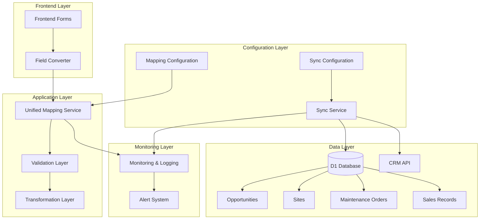

# Unified CRM Mapping System - 技術設計書

*創建時間: 2025-07-26*
*項目代號: unified-crm-mapping*

## 系統架構概覽

### 整體架構圖



### 核心設計原則

1. **統一性原則**: 所有 CRM 對象使用相同的映射和同步架構
2. **配置驅動**: 映射邏輯通過配置文件管理，無需修改代碼
3. **可擴展性**: 支援輕鬆新增新的 CRM 對象和欄位
4. **容錯性**: 完善的錯誤處理和恢復機制
5. **效能優化**: 批量處理和智能同步機制

## 核心組件設計

### 1. 統一映射服務 (UnifiedMappingService)

#### 類別架構
```javascript
class UnifiedMappingService {
  constructor(config) {
    this.config = config;
    this.validators = new Map();
    this.transformers = new Map();
  }
  
  // 核心映射方法
  async mapFrontendToD1(objectType, frontendData) { }
  async mapD1ToCRM(objectType, d1Data) { }
  async mapCRMToD1(objectType, crmData) { }
  
  // 批量處理方法
  async batchMapFrontendToD1(objectType, dataArray) { }
  async batchMapD1ToCRM(objectType, dataArray) { }
  async batchMapCRMToD1(objectType, dataArray) { }
  
  // 驗證方法
  async validate(objectType, data, targetFormat) { }
  
  // 配置管理
  reloadConfig() { }
  getObjectConfig(objectType) { }
}
```

#### 映射配置結構
```json
{
  "objects": {
    "opportunities": {
      "apiType": "standard",
      "endpoint": "/cgi/crm/v2/data/query",
      "apiName": "NewOpportunityObj",
      "responseDataPath": "result.data.dataList",
      "fields": {
        "name": {
          "frontend": "opportunityName",
          "d1": "name",
          "crm": "name",
          "type": "string",
          "required": true,
          "maxLength": 255,
          "validation": "notEmpty"
        },
        "customer": {
          "frontend": "customerName", 
          "d1": "customer",
          "crm": "customer",
          "type": "string",
          "required": false,
          "maxLength": 255
        }
      }
    },
    "sites": {
      "apiType": "custom",
      "endpoint": "/cgi/crm/custom/v2/data/query",
      "apiName": "object_8W9cb__c",
      "responseDataPath": "result.dataList",
      "relationships": {
        "opportunity_id": {
          "targetObject": "opportunities",
          "foreignKey": "field_1P96q__c"
        }
      },
      "fields": {
        "name": {
          "frontend": "siteName",
          "d1": "name", 
          "crm": "name",
          "type": "string",
          "required": true,
          "maxLength": 255
        },
        "building_type": {
          "frontend": "buildingType",
          "d1": "building_type",
          "crm": "field_WD7k1__c",
          "type": "string",
          "required": false,
          "enum": ["A棟", "B棟", "C棟"]
        }
      }
    }
  }
}
```

### 2. 重新設計的資料庫架構

#### 新資料庫表結構
```sql
-- 商機表 (優化版)
CREATE TABLE IF NOT EXISTS opportunities (
    id TEXT PRIMARY KEY,
    name TEXT NOT NULL,
    customer TEXT,
    amount INTEGER DEFAULT 0,
    stage TEXT,
    create_time INTEGER NOT NULL,
    update_time INTEGER NOT NULL,
    synced_at INTEGER,
    raw_data TEXT, -- JSON 格式完整原始數據
    version INTEGER DEFAULT 1, -- 版本控制
    UNIQUE(id)
);

-- 案場表 (重新設計)
CREATE TABLE IF NOT EXISTS sites (
    id TEXT PRIMARY KEY,
    name TEXT NOT NULL,
    opportunity_id TEXT,
    building_type TEXT,
    floor_info TEXT,
    room_info TEXT,
    construction_status TEXT,
    contractor_team TEXT,
    create_time INTEGER NOT NULL,
    update_time INTEGER NOT NULL,
    synced_at INTEGER,
    raw_data TEXT,
    version INTEGER DEFAULT 1,
    FOREIGN KEY (opportunity_id) REFERENCES opportunities(id),
    UNIQUE(id)
);

-- 維修單表
CREATE TABLE IF NOT EXISTS maintenance_orders (
    id TEXT PRIMARY KEY,
    name TEXT NOT NULL,
    opportunity_id TEXT,
    site_id TEXT,
    issue_type TEXT,
    status TEXT,
    priority TEXT,
    assigned_to TEXT,
    create_time INTEGER NOT NULL,
    update_time INTEGER NOT NULL,
    synced_at INTEGER,
    raw_data TEXT,
    version INTEGER DEFAULT 1,
    FOREIGN KEY (opportunity_id) REFERENCES opportunities(id),
    FOREIGN KEY (site_id) REFERENCES sites(id),
    UNIQUE(id)
);

-- 銷售記錄表
CREATE TABLE IF NOT EXISTS sales_records (
    id TEXT PRIMARY KEY,
    name TEXT NOT NULL,
    opportunity_id TEXT,
    record_type TEXT,
    content TEXT,
    interactive_type TEXT,
    location TEXT,
    is_external_visible BOOLEAN DEFAULT FALSE,
    create_time INTEGER NOT NULL,
    update_time INTEGER NOT NULL,
    synced_at INTEGER,
    raw_data TEXT,
    version INTEGER DEFAULT 1,
    FOREIGN KEY (opportunity_id) REFERENCES opportunities(id),
    UNIQUE(id)
);

-- 統一同步狀態表
CREATE TABLE IF NOT EXISTS sync_status (
    object_type TEXT PRIMARY KEY,
    last_sync_time INTEGER,
    last_sync_count INTEGER,
    total_count INTEGER,
    success_count INTEGER,
    failure_count INTEGER,
    status TEXT CHECK(status IN ('idle', 'syncing', 'completed', 'failed')),
    error_message TEXT,
    sync_duration INTEGER, -- 同步耗時（毫秒）
    created_at INTEGER DEFAULT (unixepoch()),
    updated_at INTEGER DEFAULT (unixepoch())
);

-- 同步日誌表
CREATE TABLE IF NOT EXISTS sync_logs (
    id INTEGER PRIMARY KEY AUTOINCREMENT,
    object_type TEXT NOT NULL,
    operation_type TEXT NOT NULL, -- 'full_sync', 'incremental_sync', 'manual_sync'
    trigger_source TEXT NOT NULL, -- 'cron', 'manual', 'form_submit'
    user_agent TEXT,
    started_at INTEGER NOT NULL,
    completed_at INTEGER,
    status TEXT CHECK(status IN ('started', 'completed', 'failed')) DEFAULT 'started',
    processed_count INTEGER DEFAULT 0,
    success_count INTEGER DEFAULT 0,
    failure_count INTEGER DEFAULT 0,
    error_details TEXT, -- JSON 格式錯誤詳情
    duration INTEGER, -- 耗時（毫秒）
    memory_usage INTEGER, -- 記憶體使用（KB）
    created_at INTEGER DEFAULT (unixepoch())
);

-- 建立優化索引
CREATE INDEX IF NOT EXISTS idx_opportunities_name ON opportunities(name);
CREATE INDEX IF NOT EXISTS idx_opportunities_customer ON opportunities(customer);
CREATE INDEX IF NOT EXISTS idx_opportunities_update_time ON opportunities(update_time);
CREATE INDEX IF NOT EXISTS idx_opportunities_synced_at ON opportunities(synced_at);

CREATE INDEX IF NOT EXISTS idx_sites_name ON sites(name);
CREATE INDEX IF NOT EXISTS idx_sites_opportunity_id ON sites(opportunity_id);
CREATE INDEX IF NOT EXISTS idx_sites_building_type ON sites(building_type);
CREATE INDEX IF NOT EXISTS idx_sites_update_time ON sites(update_time);

CREATE INDEX IF NOT EXISTS idx_maintenance_opportunity_id ON maintenance_orders(opportunity_id);
CREATE INDEX IF NOT EXISTS idx_maintenance_site_id ON maintenance_orders(site_id);
CREATE INDEX IF NOT EXISTS idx_maintenance_status ON maintenance_orders(status);

CREATE INDEX IF NOT EXISTS idx_sales_opportunity_id ON sales_records(opportunity_id);
CREATE INDEX IF NOT EXISTS idx_sales_record_type ON sales_records(record_type);
CREATE INDEX IF NOT EXISTS idx_sales_external_visible ON sales_records(is_external_visible);

CREATE INDEX IF NOT EXISTS idx_sync_logs_object_type ON sync_logs(object_type);
CREATE INDEX IF NOT EXISTS idx_sync_logs_started_at ON sync_logs(started_at);
CREATE INDEX IF NOT EXISTS idx_sync_logs_status ON sync_logs(status);
```

### 3. 智能同步服務 (IntelligentSyncService)

#### 同步策略設計
```javascript
class IntelligentSyncService {
  constructor(env, mappingService) {
    this.env = env;
    this.mappingService = mappingService;
    this.rateLimiter = new RateLimiter(100, 20000); // 100 requests per 20 seconds
  }
  
  // 智能增量同步
  async performIncrementalSync(objectType, options = {}) {
    const config = this.mappingService.getObjectConfig(objectType);
    const lastSyncTime = await this.getLastSyncTime(objectType);
    
    // 構建增量查詢條件
    const queryConditions = {
      ...config.baseQuery,
      filters: [
        {
          field: 'last_modified_time',
          operator: 'gt',
          value: lastSyncTime
        }
      ]
    };
    
    return await this.executeBatchSync(objectType, queryConditions, options);
  }
  
  // 批量同步執行
  async executeBatchSync(objectType, queryConditions, options) {
    const batchSize = options.batchSize || 100;
    const maxRetries = options.maxRetries || 3;
    let offset = 0;
    let totalProcessed = 0;
    let totalSuccess = 0;
    let errors = [];
    
    while (true) {
      try {
        // 獲取批量數據
        const batch = await this.fetchCRMData(objectType, {
          ...queryConditions,
          limit: batchSize,
          offset: offset
        });
        
        if (batch.length === 0) break;
        
        // 映射並保存到 D1
        const mappedData = await this.mappingService.batchMapCRMToD1(objectType, batch);
        const saveResult = await this.batchSaveToD1(objectType, mappedData);
        
        totalProcessed += batch.length;
        totalSuccess += saveResult.successCount;
        errors.push(...saveResult.errors);
        
        offset += batchSize;
        
        // 檢查執行時間限制
        if (this.isNearTimeLimit()) {
          await this.scheduleRemainingWork(objectType, offset, queryConditions);
          break;
        }
        
      } catch (error) {
        errors.push({
          batch: { offset, size: batchSize },
          error: error.message,
          timestamp: Date.now()
        });
        
        if (--maxRetries <= 0) break;
        await this.sleep(1000); // 重試前等待
      }
    }
    
    return {
      totalProcessed,
      totalSuccess,
      failureCount: totalProcessed - totalSuccess,
      errors
    };
  }
  
  // 關聯性同步順序管理
  async executeOrderedSync() {
    const syncOrder = [
      'opportunities',  // 基礎對象，必須先同步
      'sites',         // 依賴 opportunities
      'maintenance_orders', // 依賴 opportunities 和 sites
      'sales_records'  // 部分依賴 opportunities
    ];
    
    const results = {};
    
    for (const objectType of syncOrder) {
      try {
        results[objectType] = await this.performIncrementalSync(objectType);
        await this.updateSyncStatus(objectType, 'completed', results[objectType]);
      } catch (error) {
        results[objectType] = { error: error.message, status: 'failed' };
        await this.updateSyncStatus(objectType, 'failed', results[objectType]);
        
        // 如果基礎對象同步失敗，中止後續依賴對象的同步
        if (objectType === 'opportunities') {
          console.error('基礎對象同步失敗，中止後續同步');
          break;
        }
      }
    }
    
    return results;
  }
}
```

### 4. 數據遷移策略

#### 遷移執行計劃
```javascript
class DataMigrationService {
  constructor(env, mappingService) {
    this.env = env;
    this.mappingService = mappingService;
  }
  
  // 主遷移流程
  async executeMigration() {
    const migrationSteps = [
      { name: 'backup_existing_data', critical: true },
      { name: 'create_new_schema', critical: true },
      { name: 'migrate_opportunities', critical: true },
      { name: 'migrate_sites', critical: true },
      { name: 'migrate_maintenance_orders', critical: false },
      { name: 'migrate_sales_records', critical: false },
      { name: 'update_indexes', critical: true },
      { name: 'verify_data_integrity', critical: true },
      { name: 'cleanup_old_tables', critical: false }
    ];
    
    const results = {};
    
    for (const step of migrationSteps) {
      try {
        console.log(`🔄 執行遷移步驟: ${step.name}`);
        results[step.name] = await this[step.name]();
        console.log(`✅ 完成遷移步驟: ${step.name}`);
      } catch (error) {
        console.error(`❌ 遷移步驟失敗: ${step.name}`, error);
        results[step.name] = { error: error.message, timestamp: Date.now() };
        
        if (step.critical) {
          console.error('關鍵步驟失敗，啟動回滾程序');
          await this.rollbackMigration(results);
          throw new Error(`關鍵遷移步驟失敗: ${step.name}`);
        }
      }
    }
    
    return results;
  }
  
  // 數據完整性驗證
  async verify_data_integrity() {
    const checks = [
      this.verifyRecordCounts(),
      this.verifyForeignKeyIntegrity(),
      this.verifyMandatoryFields(),
      this.verifyDataTypes(),
      this.verifyIndexes()
    ];
    
    const results = await Promise.allSettled(checks);
    const failures = results.filter(r => r.status === 'rejected');
    
    if (failures.length > 0) {
      throw new Error(`數據完整性檢查失敗: ${failures.map(f => f.reason).join(', ')}`);
    }
    
    return { status: 'success', checks: results.length };
  }
  
  // 回滾機制
  async rollbackMigration(migrationResults) {
    console.log('🔄 開始執行回滾程序...');
    
    try {
      // 恢復備份的資料
      await this.restoreFromBackup();
      
      // 清理新建的表結構
      await this.cleanupNewSchema();
      
      console.log('✅ 回滾完成，系統已恢復到原始狀態');
    } catch (rollbackError) {
      console.error('❌ 回滾失敗，系統可能處於不一致狀態', rollbackError);
      throw new Error('回滾失敗，需要手動干預');
    }
  }
}
```

### 5. 監控和告警系統

#### 監控指標設計
```javascript
class MonitoringService {
  constructor(env) {
    this.env = env;
    this.metrics = new Map();
  }
  
  // 收集同步指標
  async collectSyncMetrics(objectType, operation, result) {
    const metric = {
      timestamp: Date.now(),
      objectType,
      operation,
      duration: result.duration,
      processedCount: result.totalProcessed,
      successCount: result.totalSuccess,
      failureCount: result.failureCount,
      successRate: result.totalSuccess / result.totalProcessed,
      memoryUsage: this.getCurrentMemoryUsage(),
      errors: result.errors
    };
    
    await this.saveMetric(metric);
    await this.checkAlertConditions(metric);
  }
  
  // 告警條件檢查
  async checkAlertConditions(metric) {
    const alertRules = [
      {
        name: 'high_failure_rate',
        condition: metric.successRate < 0.95,
        severity: 'critical',
        message: `${metric.objectType} 同步成功率過低: ${(metric.successRate * 100).toFixed(1)}%`
      },
      {
        name: 'slow_sync_performance',
        condition: metric.duration > 300000, // 5 minutes
        severity: 'warning',
        message: `${metric.objectType} 同步耗時過長: ${metric.duration}ms`
      },
      {
        name: 'high_memory_usage',
        condition: metric.memoryUsage > 100 * 1024 * 1024, // 100MB
        severity: 'warning',
        message: `記憶體使用過高: ${(metric.memoryUsage / 1024 / 1024).toFixed(1)}MB`
      }
    ];
    
    for (const rule of alertRules) {
      if (rule.condition) {
        await this.triggerAlert(rule, metric);
      }
    }
  }
  
  // 健康狀況儀表板
  async generateHealthDashboard() {
    const last24Hours = Date.now() - 24 * 60 * 60 * 1000;
    
    const healthData = {
      overview: {
        totalSyncs: await this.countSyncs(last24Hours),
        successRate: await this.calculateSuccessRate(last24Hours),
        averageDuration: await this.calculateAverageDuration(last24Hours),
        activeAlerts: await this.getActiveAlerts()
      },
      objectMetrics: {}
    };
    
    const objectTypes = ['opportunities', 'sites', 'maintenance_orders', 'sales_records'];
    
    for (const objectType of objectTypes) {
      healthData.objectMetrics[objectType] = {
        lastSyncTime: await this.getLastSyncTime(objectType),
        recordCount: await this.getRecordCount(objectType),
        recentErrors: await this.getRecentErrors(objectType, last24Hours),
        syncFrequency: await this.calculateSyncFrequency(objectType, last24Hours)
      };
    }
    
    return healthData;
  }
}
```

## API 設計

### 統一映射 API 端點

```javascript
// GET /api/mapping/config/{objectType}
// 獲取對象映射配置
async function getMappingConfig(objectType) {
  return {
    objectType,
    config: mappingService.getObjectConfig(objectType),
    lastUpdated: configLastModified
  };
}

// POST /api/mapping/transform
// 執行數據轉換
async function transformData(request) {
  const { objectType, sourceFormat, targetFormat, data } = await request.json();
  
  const result = await mappingService.transform(objectType, data, sourceFormat, targetFormat);
  
  return {
    success: true,
    transformedData: result.data,
    warnings: result.warnings,
    errors: result.errors
  };
}

// POST /api/sync/{objectType}/incremental
// 執行增量同步
async function performIncrementalSync(objectType, options) {
  const syncResult = await syncService.performIncrementalSync(objectType, options);
  
  return {
    success: true,
    objectType,
    ...syncResult,
    timestamp: Date.now()
  };
}

// GET /api/monitoring/health
// 獲取系統健康狀況
async function getSystemHealth() {
  return await monitoringService.generateHealthDashboard();
}
```

## 部署策略

### 分階段部署計劃

#### Phase 1: 基礎設施準備 (第1週)
1. **配置系統部署**
   - 部署映射配置管理系統
   - 建立新的資料庫表結構
   - 配置監控和日誌系統

#### Phase 2: 核心服務部署 (第2週)  
2. **統一映射服務**
   - 部署 UnifiedMappingService
   - 執行數據遷移
   - 驗證映射準確性

#### Phase 3: 同步系統升級 (第3週)
3. **智能同步服務**
   - 部署新的同步機制
   - 執行並行測試
   - 切換到新的同步服務

#### Phase 4: 監控和優化 (第4週)
4. **系統優化**
   - 效能調優
   - 監控告警配置
   - 完整性測試和驗收

### 風險控制措施

1. **藍綠部署**
   - 維持兩套完整的部署環境
   - 零停機時間切換
   - 即時回滾能力

2. **金絲雀發布**
   - 10% 流量先導入新系統
   - 監控關鍵指標
   - 逐步增加流量比例

3. **完整備份策略**
   - 部署前完整數據備份
   - 配置文件版本控制
   - 自動化回滾腳本

## 測試策略

### 單元測試範圍
- UnifiedMappingService 所有方法
- 數據驗證邏輯
- 批量處理機制
- 錯誤處理機制

### 整合測試範圍
- 完整的同步流程
- 數據庫操作
- CRM API 調用
- 監控和告警

### 效能測試
- 大量數據同步測試 (3943 筆案場)
- 並發處理能力測試
- 記憶體使用測試
- 響應時間測試

### 驗收測試標準
- 映射準確率 100%
- 同步成功率 > 99%
- 響應時間 < 需求標準
- 零數據遺失

這個技術設計書提供了完整的實作指導，確保統一 CRM 映射系統能夠滿足所有功能和非功能性需求。